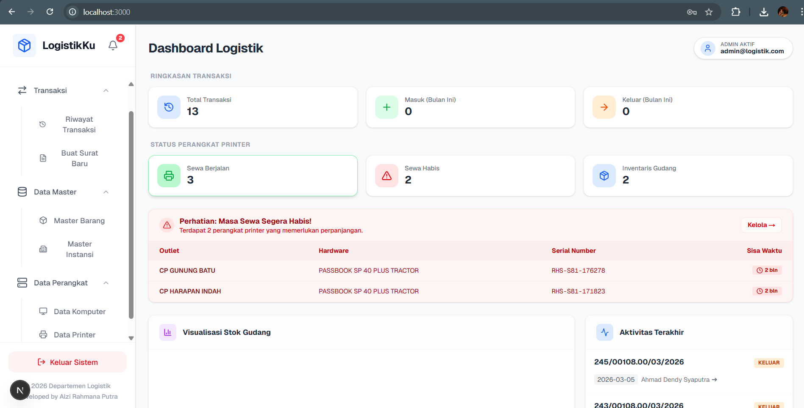

# 📦 LogistikKu — Sistem Manajemen Logistik & Inventaris

  
  
  

**LogistikKu** adalah aplikasi web berbasis dashboard untuk memantau, mencatat, dan mengelola aset logistik secara efisien.  
Aplikasi ini tidak hanya melacak arus barang masuk/keluar, tetapi juga menyediakan fitur pemantauan masa sewa perangkat (_hardware_) secara real-time.

---

## 📸 Tampilan Aplikasi

Atau ingin melihat langsung versi live?  
👉 Kunjungi: https://logistik-app-sigma.vercel.app/

### 🔐 Demo Akun
Gunakan akun berikut untuk mencoba aplikasi:

- **Email:** user@logistik.co.id  
- **Password:** user12345
---

## ✨ Fitur Utama (Enterprise-Grade)

- 📊 **Dashboard Eksekutif & Interaktif** Ringkasan transaksi (Masuk/Keluar), visualisasi stok, dan *breakdown* jumlah aset IT (Komputer & Printer) berdasarkan model dan statusnya secara *real-time*.
- 🔐 **Manajemen Akses (Role-Based Access Control)** Sistem keamanan otorisasi terpusat. **Admin** memiliki kendali penuh (CRUD & Kelola User), sementara **User Biasa** dibatasi pada mode *Read-Only* (Hanya Baca) untuk mencegah manipulasi data yang tidak sah.
- 🖨️ **Pelacakan Aset & QR Code Generator** Pencatatan spesifikasi detail aset (SN, IP, MAC Address, CPU, RAM) yang terintegrasi dengan fitur pencetakan stiker label **QR Code otomatis**. Memudahkan tim teknisi melacak perangkat di lapangan hanya dengan *scan* kamera HP.
- ⚡ **Import Data Massal (Bulk Import CSV)** Menghemat waktu *data entry* hingga 90%. Admin dapat mengunggah ratusan data perangkat/aset baru sekaligus menggunakan *template* Excel/CSV dengan dukungan *Firebase Batch Write* yang super cepat.
- ⚠️ **Sistem Notifikasi Pintar** Peringatan otomatis berprioritas tinggi di Dashboard untuk melacak perangkat yang masa kontrak/sewanya akan segera habis (< 3 bulan) atau sudah berstatus kedaluwarsa.
- 📖 **Audit Trail (Log Aktivitas Sistem)** Sistem akuntabilitas internal yang mencatat setiap rekam jejak pengguna. Melacak siapa (email) melakukan apa (Tambah/Edit/Hapus), kapan, dan pada modul apa untuk transparansi data.
- 📑 **Manajemen Riwayat & Export Laporan** Pusat data transaksi dan aktivitas yang dilengkapi Pencarian Cerdas, Filter Data, **Sistem Paginasi Tabel** (menjaga aplikasi tetap ringan meski menampung ribuan data), dan fitur ekspor *One-Click* ke format CSV/Excel.
- ⚙️ **Kalkulasi & Otomatisasi Cerdas** Perhitungan masa sewa otomatis (dalam bulan), penentuan status (Sewa Berjalan/Inventaris/Sewa Habis), serta penggabungan *badge* kondisi perangkat untuk efisiensi *User Interface*.

---

## 🚀 Getting Started

Proyek ini menggunakan:

- [Next.js](https://nextjs.org/)
- Firebase (Authentication & Database)

---

## 📋 Persyaratan

Pastikan Anda telah menginstal:

- Node.js ≥ 18.x
- Package Manager (npm / yarn / pnpm / bun)
- Akun Firebase

---

## ⚙️ Instalasi

Clone repository dan install dependencies:

git clone https://github.com/alziputra/logistik-app.git  
cd logistik-app  
npm install

---

## 🔐 Konfigurasi Environment

Buat file `.env.local` di root project, lalu isi dengan konfigurasi Firebase:

# Firebase Config  
NEXT_PUBLIC_FIREBASE_API_KEY=your_api_key  
NEXT_PUBLIC_FIREBASE_AUTH_DOMAIN=your_project.firebaseapp.com  
NEXT_PUBLIC_FIREBASE_PROJECT_ID=your_project_id  
NEXT_PUBLIC_FIREBASE_STORAGE_BUCKET=your_project.appspot.com  
NEXT_PUBLIC_FIREBASE_MESSAGING_SENDER_ID=your_sender_id  
NEXT_PUBLIC_FIREBASE_APP_ID=your_app_id  
  
# App Config  
NEXT_PUBLIC_APP_ID=logistikku_app_01

> ⚠️ **Penting:**  
> Jangan pernah commit file `.env.local` ke repository publik.

---

## ▶️ Menjalankan Aplikasi

Jalankan development server:

npm run dev

Buka di browser:  
👉 [http://localhost:3000](http://localhost:3000)

---

## 📚 Dokumentasi

Pelajari lebih lanjut teknologi yang digunakan:

- Next.js → [https://nextjs.org/docs](https://nextjs.org/docs)
- Tailwind CSS → [https://tailwindcss.com/docs](https://tailwindcss.com/docs)
- Firebase → [https://firebase.google.com/docs](https://firebase.google.com/docs)

---

## ☁️ Deployment

Deploy dengan mudah menggunakan **Vercel**:

1. Import repository ke Vercel
2. Tambahkan environment variables dari `.env.local`
3. Deploy

📖 Detail: [https://nextjs.org/docs/deployment](https://nextjs.org/docs/deployment)

---

## 👨‍💻 Author

Dikembangkan oleh **Alzi Rahmana Putra**